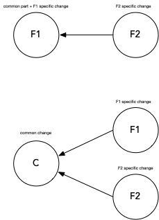
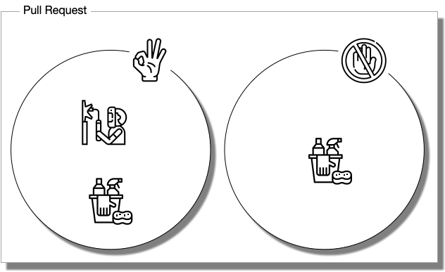

= Guidelines to Create Pull Request
:version: 1.0.1-SNAPSHOT

Version: {version}

== License

The license of this document is CC BY 4.0 as defined in

https://creativecommons.org/licenses/by/4.0/

== Introduction and Document Scope

Pull requests are modification requests in software development when a developer creates a unit of
change in the source code and requests that the modifications get incorporated into the "master"
source code and thus become part of the project.

The aim of the pull request, as a code review process, is to provide extra quality assurance means
to the software development, ensuring that each and every change is reviewed by at least two people.

The process handling pull requests is a multi-step workflow with several parties participating.
During the process the parties communicate, discuss different opinions and point out problems in
the code. Practice shows that this process can lead to interpersonal problems and human conflicts.

This document gives technical and non-technical guidelines to follow in order to avoid human
conflicts and optimize the process, aiming at the highest possible efficiency.

=== Notes

These guidelines are mainly programming language agnostic. In case there is a guideline that is
language specific then it is denoted in the section title between parentheses, e.g.: (Java).

The guidelines are independent of the tool that is used. However, the guidelines are expressed
in a way that assume the use of git and GitHub. This is because most of the application of the
guides will use this tool. Nevertheless the guides are general and can be adapted to other tools.
Basic knowledge and understanding of git is assumed.

=== Process Actors

There are at least two actors in the pull request process. One actor asking the pull and the
other one merging the change to the "master" source.

The detailed model defines four actors:

requester:: the actor, who is requesting the change and the merge
commenter:: actor who makes suggestions, comments on the changed code
approver:: the actor whoa approves the change
merger:: the actor who performs the merging

Most of the actual executions of the PR handling can be described using this model
assigning one or more acting roles to the individual participants. The *requester* should
eventually a different person, but one or more of the roles *commenter*, *approver* and *merger*
may be assigned to a single person. The same time there can be more than one person for each of these
roles, although the actual merging of a single pull request is going to be executed by a single person.

A more detailed description of how the different roles can be assigned to different personnel
and what assignment structures may work
can be part of a document that describes the actual procedure of PR handling. This document does
not cover that specific topic.

== Definitions

PR:: pull request

IDE:: Integrated Development Environment, like Eclipse, IntelliJ, NetBeans

PR code::
is the code that the developer created in its own branch and that is to be merged in the pull
request process

master code:: is the source code in the master branch. This is the code into which the PR code is
  merged into

== Guidelines

=== Scope of a Pull Request

====
A single PR should focus on one single functional or non-functional change.
====

If there are multiple changes then they have to be developed in sepatare branches and their
incorporation into the main branch (usually `master`) should utilize multiple PRs.

It may happen that two changes share some common code change parts. In that case, there are
two different approaches:

. Order the changes and the first change contains the common part of the two changes. In this
case the second change depends on the first one. Use this if the changes alone are
not too big and creating a third PR would be too much overhead. `F1` <- `F2`

. Create a change that contains only the common part that the other two changes depend on and the
separate changes depend only on this common change. In that case we have the `C` common change and the
two changes `C` <- `F1` && `C` <- `F2`, but the two changes `F1` and `F2` are independent of
each other. Use this if the changes are not trivial and splitting them into smaller
parts makes sense. Also when the changes are complex and it cannot be foreseen
which change is going to be reviewed first. That way `F1` and `F2` do not block each other.

=== Code Cleanup

====
Code Cleanup should be in a separate pull request.
====

When developing a new feature, it is sometimes tempting to modify code to improve the overall
general structure of the code. These changes should be limited. For example you may need to modify
a method to implement a change and there is a `for` loop that you can alter to be the more modern
for-each style or even to use Java 8 streams. In case the code inside the loop is modified for the
change implementation then the modification of the loop can be part of the same change. It is a
code cleanup of a code that is changed. If the for loop is not altered in any way and there is
code change only before and/or after the loop then the change of the loop may not be a good decision.

For example: you may need to modify a method to implement a change and there is a `for` loop that
you can alter to be the more modern for-each style or even to use Java 8 streams.
If the code inside the loop has to be changed because it's needed for the implementation of the new feature, then the modification of
the loop can be part of the same change. This is code cleanup of code that changed. If the for
loop does not have to be altered in any way and there is code change only before and/or after the loop then the
change of the loop may not be a good decision.

If there is any doubt about changing the code in the same pull request then it is a safe choice not to
include the change into the specific pull request.

This recommendation does not mean that code cleanup should not be done. On the contrary: Code
cleanup is important and it deserves its own separate pull request.

=== Import Optimization

====
Import Optimization is code cleanup and thus should be in a separate pull request.
====

This section makes sense only for languages that have the notion of `import` in the
source code.

Import optimization is the act of one or more of the following actions:

* removing import statements that are not needed any more
* rearrange the order of import statements (including grouping)
* change wild-card import statements into explicit import statements or
  the other way around according to local policies.

Import optimizations are usually performed automatically by the IDE when the code is formatted,
saved. When the master code has different optimization rules (ordering, grouping) the import
optimization creates extra differences in the PR that have no functional relevance.

It may also happen many times that import statements in the checked in code are superfluous and
not coherent with the local policies. It is advised to enforce the local development
bylaws using static code analysis if possible to avoid such a situation.

PRs must avoid import optimizations that are not related to the actual change.

When a change eliminates the use of a class or method that was available through the use of
an import statement then the removal of the import statement induced by that change should
eventually be part of the PR.

(Java) The opposite situation, when a change makes it necessary to import a class or method
(static import) then the PR should  eventually contain the change of the `import` statements.
The fact that the PR should contain the new `import` statement(s) is obvious: without the new
statements the code in the PR does not compile.

(Java) When the change in the code uses some method static imported then the new static import should
eventually be part of the PR. If the code uses some previously statically imported methods, but
the PR code uses the method with the full name, including the class name and it makes possible to
delete the static import then this change should be part of the PR. The deletion of the static import
statement is the consequence of the code change and that way this case is equivalent with the one
when a class is not used any more and thus not imported any more.

In other cases the optimization of the import statements should not be part of the PR, rather
a separate PR should be created that contains nothing but import optimization and possibly
other code cleanup.

=== Formatting Change

====
Formatting change is cleanup and thus should be in a separate pull request.
====

It is very easy to modify the formatting of the code. When the PR contains a lot of formatting
change then the actual code change may easily be overseen in the numerous formatting change. This is
something to avoid.

If (1) the local formatting (very specifically the developers IDE formatting setting) is the same as the
project setting and (2) the master code is well formatted then the PR request will not contains any
reformatted line that is not new, deleted or changed. Formatting clutter in the PR is only possible
when either there is a different setting in the developer IDE and/or the master code is not
formatted properly.

To avoid that situation (*formatting recommendations*)

 * it is recommended to have well defined formatting rules defining the use of tab character
   and space character for formatting
 * placement of opening and closing braces (if the language uses those),
 * needed spaces between specific tokens (e.g. betweem `if(...)` and the `{` character)
 * tool has to enforce the formatting and automatically signal the PR as build broken if the
   formatting is not matching the rules,
 * developers are provided with formatting configuration for the different IDEs that are
   accepted and used for the development.

If the local formatting is not the same as the project global formatting (1) and non-modified
lines are reformatted then the developer creating the PR should undo these formatting changes for the PR.

If the master code is not well formatted (2) and non-modified
lines are reformatted then the developer creating the PR should undo these formatting changes for the PR AND
may create a separate PR only to correct the formatting.

When the formatting changes cause significant problem during the PR handling it is recommended to
introduce the formatting recommendations (itemized above), reformat the code of the whole project
to be coherent with the formatting rules and merge this change into the master in one PR that contains
no other change.
